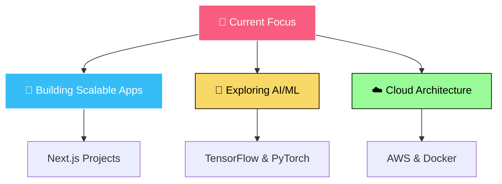

<!-- Animated Header -->
<div align="center">
  
</div>

<!-- Profile Views Counter with custom styling -->
<div align="center">
  
  
</div>

<!-- Typing Animation with Multiple Lines -->
<div align="center">
  <a href="https://git.io/typing-svg">
    
  </a>
</div>


<!-- GitHub Stats with Custom Layout -->
<div align="center">


<table>
<tr>  <td width="50%">
    
  </td>
  <td width="50%">
    
  </td>
</tr>
</table>

<!-- Language Stats with Donut Chart -->


</div>

---

<!-- Tech Stack with Creative Icons -->
<div align="center">
  
## 🛠️ **Arsenal of Creation**

### ⚡ **Languages That Bend to My Will**
<div style="display: flex; flex-wrap: wrap; gap: 10px; justify-content: center;">
  


</div>

### 🎨 **Frontend Magic**
<div style="display: flex; flex-wrap: wrap; gap: 10px; justify-content: center;">
  


</div>

### ⚙️ **Backend Sorcery**
<div style="display: flex; flex-wrap: wrap; gap: 10px; justify-content: center;">
  


</div>

### 🗄️ **Data Kingdoms**
<div style="display: flex; flex-wrap: wrap; gap: 10px; justify-content: center;">
  


</div>

</div>

---

<!-- Activity Graph -->
<div align="center">
  
## 📈 **Coding Heartbeat**

[](https://github.com/ashutosh00710/github-readme-activity-graph)

</div>

---

<!-- Snake Animation -->
<div align="center">
  
## 🐍 **Watch the Snake Devour My Commits!**

<picture>
  <source media="(prefers-color-scheme: dark)" srcset="https://raw.githubusercontent.com/arjunajaa/arjunajaa/output/github-contribution-grid-snake-dark.svg">
  <source media="(prefers-color-scheme: light)" srcset="https://raw.githubusercontent.com/arjunajaa/arjunajaa/output/github-contribution-grid-snake.svg">
  
</picture>

</div>

---

<!-- Trophies Section -->
<div align="center">
  
## 🏆 **Achievement Unlocked**


</div>

---

<!-- Current Status -->
<div align="center">
  
## 🎯 **Current Quests**



</div>

---

<!-- Random Dev Quote -->
<div align="center">
  
## 💭 **Code Wisdom**


</div>

---

<!-- Connect Section -->
<div align="center">
  
## 🌐 **Let's Connect & Create Magic Together**

[](https://instagram.com/arjunaja_)
[](mailto:aarjunaja@gmail.com)

</div>

---

<!-- Fun Interaction -->
<div align="center">
  
## 🎮 **Easter Egg**

<details>
<summary>🎯 Click here if you're brave enough!</summary>

### 🎊 Congratulations! You found the secret! 🎊

```javascript
function thankYou() {
    const message = "Thanks for visiting my profile!";
    const emoji = "🚀✨💻🔥";
    
    console.log(`${message} ${emoji}`);
    
    // Secret developer joke
    return "Why do programmers prefer dark mode? Because light attracts bugs! 🐛";
}

thankYou();
```

**Fun Fact:** You're the ****th person to discover this!

</details>

</div>

---

<!-- Footer -->
<div align="center">
  
  
  **"Code is poetry written in logic"** ✨
  
  ⭐️ From [arjunajaa](https://github.com/arjunajaa) with ❤️
  
</div>
